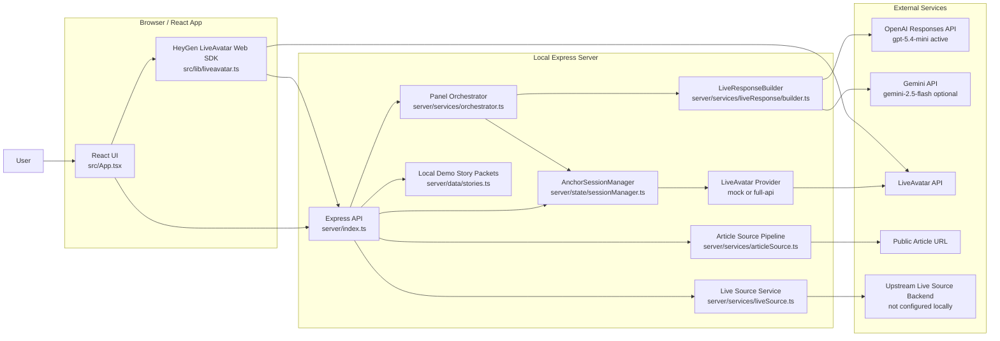

# Current System State

Generated from code inspection on 2026-04-10 for `/home/anokitv/anoubhav/live_avatar`.

## Executive summary

This repo is a localhost React + Express prototype for a multi-anchor "news desk" UI that can run in three modes:

1. `demo_story`: use local canned story packets.
2. `article`: fetch one public article URL, extract readable text, and let `Neutral Desk` speak about it.
3. `live_feed`: fetch one normalized story packet from an external backend and turn it into anchor responses.

Right now, in the local env I inspected:

- `LLM_PROVIDER=openai`
- active OpenAI model: `gpt-5.4-mini`
- alternate Gemini model available in config: `gemini-2.5-flash`
- `LIVEAVATAR_MODE=full-api`
- `LIVEAVATAR_SANDBOX=true`
- `OPENAI_API_KEY`, `GEMINI_API_KEY` or `GOOGLE_API_KEY`, and `LIVEAVATAR_API_KEY` are present
- `LIVE_SOURCE_API_URL` and `LIVE_SOURCE_CURRENT_PATH` are not set

That means the current local runtime is:

- real LiveAvatar session provisioning is enabled
- OpenAI is the active LLM provider
- live-feed mode exists in code but is disabled locally because no upstream live source is configured
- the default usable paths are `demo_story` and `article`

## Architecture diagram

## What the system actually is

This is not a general-purpose agent system. It is a turn-based avatar presentation layer wrapped around a small orchestration server.

The server owns:

- source-mode state
- selected anchors
- session provisioning
- article extraction
- live-source validation
- prompt building
- LLM turn generation

The browser owns:

- the visual UI
- starting LiveAvatar browser sessions
- media playback
- push-to-talk voice capture
- relaying session events back to the server

There is no database, no auth layer, no queue, no worker system, and no persistent storage. State is held in memory inside the Express process.

## Main runtime flows

### 1. Bootstrap

On startup, the server:

- builds the LiveAvatar provider
- builds the live-source adapter
- builds the LLM response builder
- prewarms the `neutral` anchor session
- returns anchors, sessions, stories, provider mode, and live status from `/api/bootstrap`

Relevant files:

- `server/index.ts`
- `server/state/sessionManager.ts`
- `server/config.ts`

### 2. Demo story mode

This is the simplest working path right now.

Flow:

1. The UI starts with a local `StoryPacket` from `server/data/stories.ts`.
2. The user selects 1 to 3 anchors.
3. The user submits a prompt like "What changed?"
4. The server builds a speaking order.
5. For each selected anchor, the server asks the active LLM provider for one short JSON response, or falls back to deterministic template wording.
6. The browser plays those turns one at a time through LiveAvatar when `full-api` mode is active.

Important detail: this repo does not compute political clustering from raw feeds. In demo mode, the left/right/neutral framing already exists in the local seed packet.

### 3. Article mode

This is a grounded single-anchor path.

Flow:

1. The browser posts a public URL to `/api/articles/load`.
2. The server fetches the page HTML.
3. `@mozilla/readability` plus `jsdom` extract readable article text and metadata.
4. The server builds a synthetic `StoryPacket` from the article.
5. The server optionally asks the active LLM provider to rewrite the initial article summary into a better on-air turn.
6. `Neutral Desk` gets a dynamic article-specific context.
7. Follow-up article questions go through `/api/articles/ask`.

Important constraints:

- article mode is `neutral` only
- left/right framing is intentionally disabled
- answers are supposed to stay grounded to the loaded article text and metadata

### 4. Live feed mode

This is the external-backend integration path.

Flow:

1. The browser polls `/api/live/current`.
2. The server calls the configured upstream endpoint.
3. The upstream JSON must match contract `live_source_v1`.
4. The server validates it with `zod`.
5. The server converts it to a local `StoryPacket`.
6. If the upstream call fails later, the server can keep serving the last valid packet as `stale`.
7. The orchestrator then uses that packet exactly like it uses a demo packet.

Current local status:

- the code path exists
- the local env does not configure the upstream URL
- so live-feed mode is disabled in the current machine setup I inspected

## What each major piece is doing

### React client

The client is a control surface plus playback shell.

It handles:

- source-mode switching
- anchor selection
- prompt entry
- live packet polling
- starting and reconnecting browser LiveAvatar sessions
- sending playback text into the LiveAvatar session
- push-to-talk capture for article or live-feed mode
- relaying session lifecycle and speech events back to the server

The browser does not call the LLM directly.

### Express server

The server is the control plane.

It handles:

- `/api/bootstrap`
- `/api/live/current`
- `/api/sessions/sync`
- `/api/sessions/refresh`
- `/api/sessions/events`
- `/api/stories/select`
- `/api/articles/load`
- `/api/articles/ask`
- `/api/orchestrate`
- `/api/voice/turn`

### Session manager

`AnchorSessionManager` keeps one logical session per anchor and tracks:

- whether it is prewarmed or lazy
- whether it is selected
- whether it is connecting, ready, speaking, or stopped
- the last transcript
- deduping and ordering of relayed browser events

In `mock` mode, the server simulates speech events.

In `full-api` mode, the server does not synthesize speech itself. It waits for the browser LiveAvatar session to actually speak and relay events back.

### LiveAvatar provider

There are two provider implementations:

- `MockLiveAvatarProvider`: fake local session ids and fake speech events
- `FullApiLiveAvatarProvider`: create real LiveAvatar FULL sessions and return session tokens

In `full-api` mode the backend:

- creates or finds contexts
- resolves voices
- uses sandbox avatar ids when sandbox is enabled
- requests session tokens from the LiveAvatar API

The browser then uses those tokens with `@heygen/liveavatar-web-sdk`.

### Orchestrator

The orchestrator is simple and sequential.

It does not run a debate engine or planner. It:

- infers a response goal from the prompt
- decides the speaking order
- gives each anchor one turn
- passes prior anchor transcript excerpts to later anchors
- asks the LLM provider for one short structured answer per turn
- falls back to template responses if generation fails

### Article source pipeline

The article pipeline is half extraction, half lightweight heuristics.

It:

- normalizes the URL
- fetches HTML
- extracts readable text
- builds snippets and source evidence
- computes basic keywords from token frequency
- infers ad-safety with keyword heuristics
- computes a simple confidence score from extraction quality

This part is not doing semantic retrieval, embeddings, or a vector search.

### Live source service

The live source service is a strict adapter. It does not derive news intelligence itself.

It expects the upstream backend to already produce:

- neutral summary
- left framing summary
- right framing summary
- consensus points
- divergence points
- sentiment by cluster
- ad safety
- confidence
- source evidence

This repo only validates, caches, and consumes that packet.

## Models we are using

### Active right now

- OpenAI Responses API
- model: `gpt-5.4-mini`
- base URL: `https://api.openai.com/v1`

### Supported but not active right now

- Gemini generateContent API
- model: `gemini-2.5-flash`

### Non-LLM systems also in the stack

- HeyGen LiveAvatar FULL API
- `@heygen/liveavatar-web-sdk`
- `@mozilla/readability`
- `jsdom`

### What is not in the stack

- no embeddings
- no vector DB
- no retriever
- no multi-step tool-using agent
- no fine-tuned model
- no speech-to-text model running on the local server

## What the LLM side actually does

The LLM side is narrow and structured.

It is used for:

- generating one short on-air turn per anchor in demo or live-feed mode
- generating the first article summary after load
- generating article follow-up answers

It is not used for:

- fetching source data
- clustering channels
- deciding ad safety from raw streams
- managing LiveAvatar sessions
- voice capture
- media playback

### Prompt shape

For panel turns, the server sends:

- anchor identity
- selected anchors
- speaking order
- prior transcript excerpts
- response goal
- story packet fields
- numbered evidence items
- citation requirements

The model must return strict JSON:

- `transcript`
- `citedEvidenceIndexes`

The builder then maps those indexes back to real evidence items.

### Guardrails

The LLM prompts force:

- short spoken output
- no invented facts or citations
- restrained phrasing if safety is not `safe`
- explicit uncertainty when confidence is low
- anchor-specific behavior for neutral, left, and right

### Fallback behavior

If LLM generation fails:

- demo and live-feed modes fall back to deterministic template responses
- article mode falls back to extraction-based rule logic from `buildArticleFallbackResponse`

So the app can still function without a successful model call, but the responses become more templated.

## What HN exactly does

I could not find any code, config, route, or env var in this repo named `HN`, `hn`, or `Hacker News`.

So the precise answer from this codebase is:

- there is no local `HN` module here
- this repo does not directly talk to Hacker News
- this repo does not contain the upstream live-intelligence generator

The closest thing to what you may be calling `HN` is the external live-source backend used by `LiveSourceService`.

If that is what you mean, then `HN` is outside this repo and its role is to produce the normalized `live_source_v1` packet. This repo only:

- calls that endpoint
- validates the payload
- caches the last successful packet
- feeds the packet into the local orchestrator and LLM turn generator

If `HN` is a separate service or repo in your stack, I would need that codebase too to document it accurately.

## What the system is not doing

Important boundary lines:

- It is not generating cross-channel left/right summaries from raw articles or live TV feeds inside this repo.
- It is not storing historical conversations or packets.
- It is not running a backend TTS pipeline.
- It is not doing server-side speech recognition.
- It is not running simultaneous multi-anchor overlapping speech. Turns are sequential.
- It is not a production distributed system yet. It is a localhost prototype.

## The most accurate one-paragraph description

This repo is a local prototype for a three-anchor LiveAvatar news desk. The browser presents and plays avatar sessions, the Express server manages source selection and session state, an LLM generates short structured anchor turns from pre-shaped story packets or extracted article text, and LiveAvatar handles the actual rendered avatar sessions. In the local configuration I inspected, OpenAI `gpt-5.4-mini` is the active model, LiveAvatar `full-api` sandbox mode is enabled, and the upstream live-feed backend is not configured, so the system currently works primarily as a demo-story desk and a grounded article desk rather than a fully wired live-feed desk.

## Key source files

- `server/index.ts`
- `server/config.ts`
- `server/services/orchestrator.ts`
- `server/services/liveResponse/builder.ts`
- `server/services/liveResponse/openaiProvider.ts`
- `server/services/liveResponse/geminiProvider.ts`
- `server/services/liveSource.ts`
- `server/services/articleSource.ts`
- `server/services/liveavatar/fullApiLiveAvatarProvider.ts`
- `server/state/sessionManager.ts`
- `src/App.tsx`
- `src/lib/liveavatar.ts`
